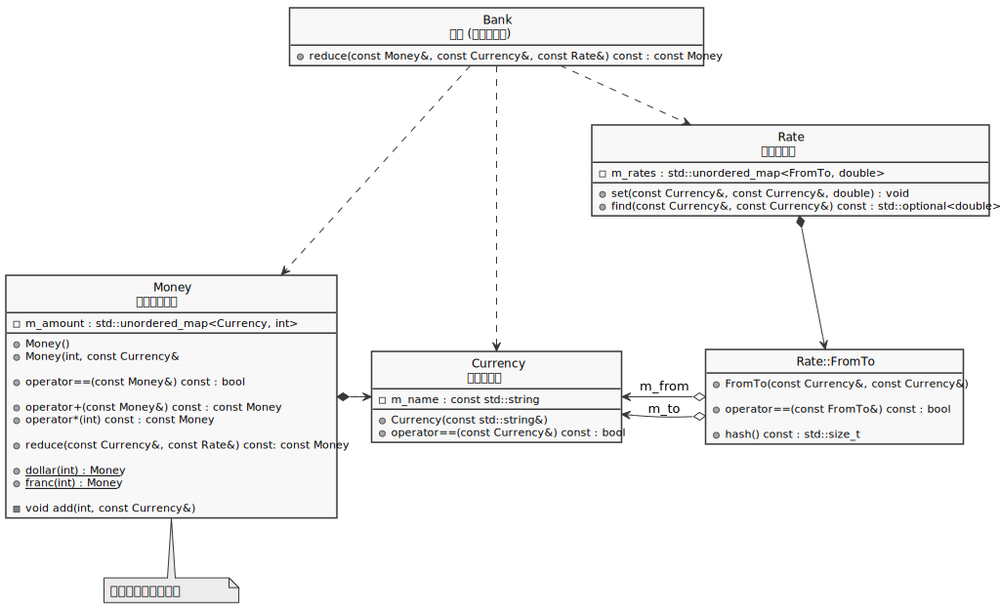

# 書籍『テスト駆動開発』のC++写経

```
$ mkdir build
$ cd build
$ make && ctest --output-on-failure
```

## 書籍との差異

1. `Money.times` および `Money.plus` を、それぞれ `Money::operator*` 、 `Money::operator+` として実装
   * C++ではこちらが自然かと
1. `Expression`クラス、`Sum`クラスは不採用
   * C++では抽象クラス(`Expression`)を実体で返却できない
   * `shared_ptr` を返すようにはできるが、そうすると3変数を加算するケースで `(a + b)->operator+(c)` という訳のわからない記述になってしまう
   * 上記デメリットを覆すだけのメリットを見出せなかった
   * `Money`に複数の通貨を保持可能な設計とすることで回避
1. 変換レートを、独立した `Rate` クラスとして実装
   * `Bank.addRate` というメソッド名は、クラスを独立すべき匂いかと
   * とはいえ `Bank` が今回程度の責務なら、そのまま残しておいても良かったかも
1. `Pair`クラスは `Rate::FromTo` として実装
   * 書籍で出てくる前に上記 3 の対応中に実装してしまった
   * `Pair`よりはマシな名前と判断した

## クラス図



## シーケンス図


